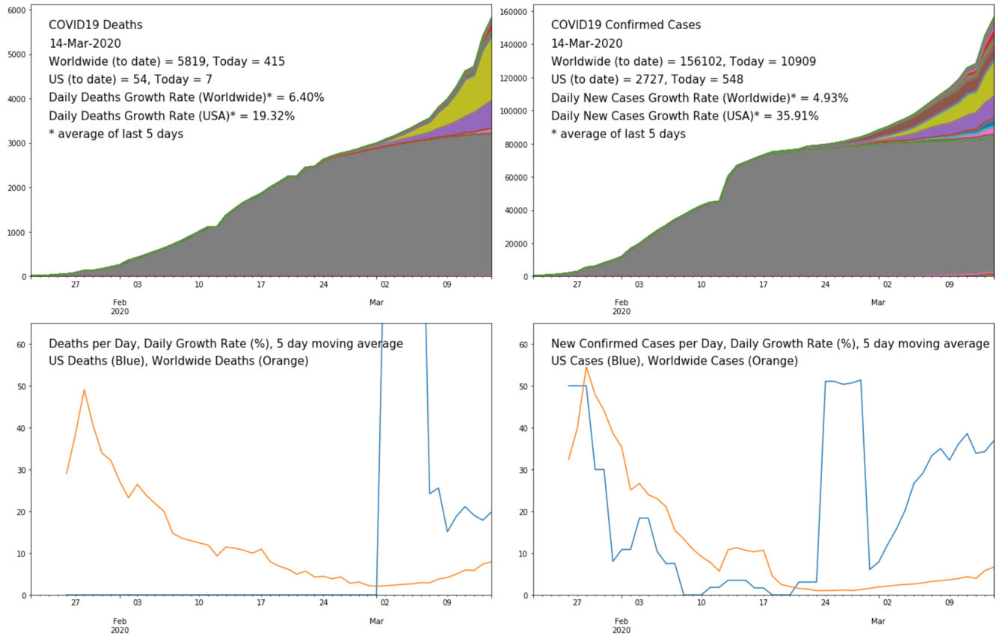

# covid19-analysis

## Overview
Python notebook covid.ipynb builds basic COVID19 charts based on JHU CSSE's https://github.com/CSSEGISandData/COVID-19.

## How to use
Just open the notebook covid.ipynb in a tool like JupyterLab. Must have basic python libraries installed (pandas, numpy, matplotlib).

## Latest chart

