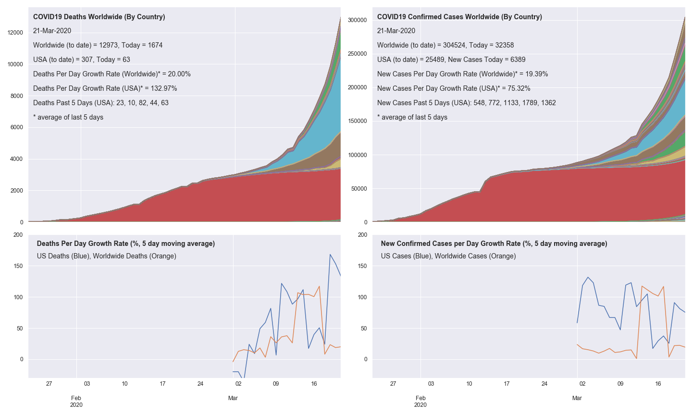

# covid19-analysis

## Overview
Python notebook [covid.ipynb](https://github.com/danlaw/covid19-analysis/blob/master/covid.ipynb) builds basic charts on the spread of COVID19 based on JHU CSSE's https://github.com/CSSEGISandData/COVID-19.

## How to use
Just open the notebook covid.ipynb in a tool like JupyterLab. Must have basic python libraries installed (pandas, numpy, matplotlib).

You can change variables like ``MovingAveDays`` to adjust the number of days in the moving average.

## Latest chart

