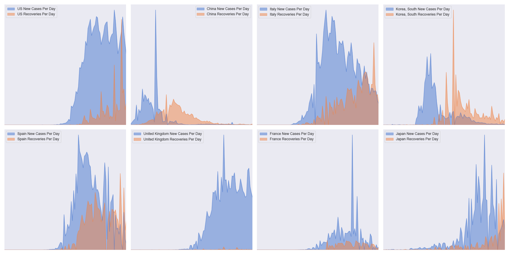

# covid19-analysis

## Overview
Python notebook [covid2.ipynb](https://github.com/danlaw/covid19-analysis/blob/master/covid2.ipynb) builds basic country-based charts on the spread of COVID19 based on JHU CSSE's https://github.com/CSSEGISandData/COVID-19, and now state-based charts as well based on data from New York Times' https://github.com/nytimes/covid-19-data.

Note: [covid.ipynb](https://github.com/danlaw/covid19-analysis/blob/master/covid.ipynb) builds charts on data from JHU CSSE's older and now depracated COVID19 data files.

## How to use
Just open the notebook covid2.ipynb in a tool like JupyterLab. Must have basic python libraries installed (pandas, numpy, matplotlib, seaborn).

You can change variables like ``MovingAveDays`` to adjust the number of days in the moving average.

## Latest chart

## New chart comparing new cases per day vs deaths per day (x 20 for visible comparison)

## New chart comparing new cases per day vs recoveries per day

## New chart comparing new cases per day vs deaths per day for select states

## New chart comparing all US territories (cases and deaths x 20)

## New chart comparing urban vs rural cases and deaths (per capita)

## New chart comparing ratio of per capita urban vs rural cases and deaths
