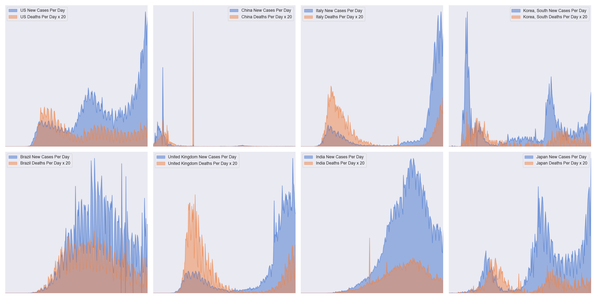

# covid19-analysis

## Overview
Python notebook [covid2.ipynb](https://github.com/danlaw/covid19-analysis/blob/master/covid2.ipynb) builds COVID19 charts based on:
* Country data from JHU CSSE's https://github.com/CSSEGISandData/COVID-19
* US state data from New York Times' https://github.com/nytimes/covid-19-data
* US county data from [USAFACTS](https://usafacts.org/visualizations/coronavirus-covid-19-spread-map/)

Note: [covid.ipynb](https://github.com/danlaw/covid19-analysis/blob/master/covid.ipynb) builds charts on data from JHU CSSE's older and now depracated COVID19 data files.

## How to use
Just open the notebook covid2.ipynb in a tool like JupyterLab. Must have basic python libraries installed (pandas, numpy, matplotlib, seaborn).

You can change variables like ``MovingAveDays`` to adjust the number of days in the moving average.

## Latest chart

## New chart looking at deaths and cases daily stats by continent

## New chart comparing ratio of new cases urban vs rural (adjusted per capita)

## New chart comparing Red States vs Blue States

## New chart comparing new cases per day vs deaths per day (x 20 for visible comparison)

## New chart comparing new cases per day vs recoveries per day

## New chart comparing all US territories (cases and deaths x 20)

